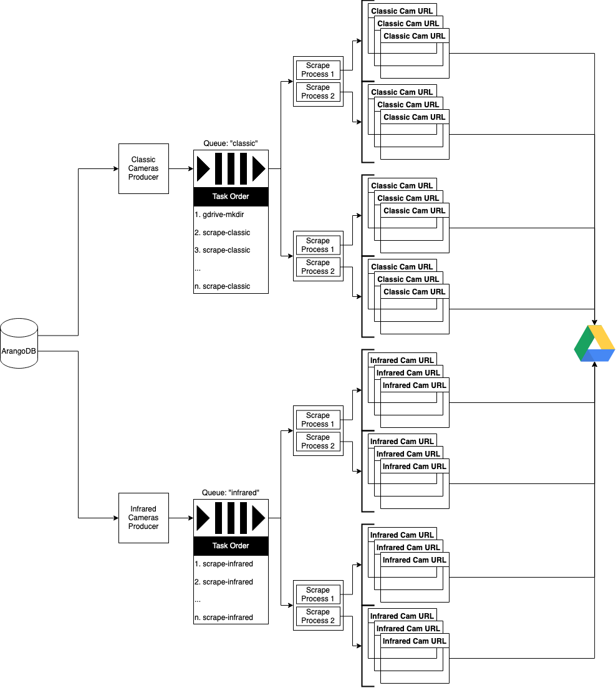

# ALERTWildfire Scraper
A multi-pronged service created for the goal of collecting training data for USC research project "Early Fire Detection" that includes:
* an ArangoDB instance which stores the urls of ALERTWildfire's cameras (as collected by ```scripts/enumerator.py```) and Tweets of interest as collected by the Tweet monitor
* a distributed and asynchronous scraper which collects classic cam images from http://www.AlertWildfire.org and uploads a zip compressed archive of the images to Google Drive after each full execution
* a Tweet monitor that saves Tweets that mention @AlertWildfire's Twitter account (potentially in regards to a wildfire) to a database
* an asynchronous scraper that retrieves infrared cam images from http://beta.alertwildfire.org/infrared-cameras/ and uploads the images to Google Drive

### ALERTWildfire
"ALERTWildfire is a network of over 900 specialized camera installations in California, Nevada, Idaho and Oregon used by first responders and volunteers to detect and monitor wildfires." - [Nevada Today](https://www.unr.edu/nevada-today/news/2021/alertwildfire-thermal-cameras)

### Contents
1. [Prerequisites](#prerequisites)
2. [ArangoDB](#arangodb)
3. [Classic Scraper and Tweet Monitor](#classic-scraper-and-tweet-alerts)
4. [Infrared Scraper](#infrared-scraper)



## Prerequisites
1. Create a Twitter Developer account, start a new project, and set the CLIENT_ID and CLIENT_SECRET environment variables in ```docker-compose.yml``` accordingly. [Step-by-step guide to making your first request to the new Twitter API v2](https://developer.twitter.com/en/docs/tutorials/step-by-step-guide-to-making-your-first-request-to-the-twitter-api-v2)
2. Create a Google Developer account, create a new project with the Google Drive API (ensure that the scopes include read access to file metadata and write/file upload access to drive), authenticate a user outside of Docker (I used Google's [quickstart](https://developers.google.com/drive/api/v3/quickstart/python#step_2_configure_the_sample) and a modified version of this exists at ```scripts/gdrive-token-helper.py```), and set PROJECT_ID, TOKEN, REFRESH_TOKEN, and GDRIVE_PARENT_DIR environment variables accordingly.

## ArangoDB
ArangoDB database instance that stores all classic camera URLS (as collected by ```scripts/enumerator.py```), infrared camera URLS, and Tweets from the Tweet Alerts monitor

Technologies:
* Docker
* ArangoDB (latest)

### Collections
<b>cameras</b> example:
```json
{
  "url": "http://www.alertwildfire.org/orangecoca/index.html?camera=Axis-DeerCanyon1",
  "timestamp": "2021-08-24T20:51:37.433870",
  "axis": "orangecoca.Axis-DeerCanyon1"
}
```
<b>tweets</b> example:
```json
{
  "id": "1430287078156234757",
  "text": "RT @CphilpottCraig: Evening timelapse 5:25-6:25pm #CaldorFire Armstrong Lookout camera. @AlertWildfire viewing North from South side of fir…",
  "scrape_timestamp": "2021-08-24T22:55:25.862109"
}
```
<b>ir-cameras</b> example::
```json
{
  "axis": "Danaher_606Z_Thermal",
  "epoch": 1631050791,
  "url": "https://weathernode.net/img/flir/Danaher_606Z_Thermal_1631050791.jpg",
  "timestamp": "2021-09-09T18:54:53.195532"
}
```

## Classic Scraper and Tweet Alerts

### RabbitMQ
Celery broker in Scraper.

Technologies:
* Docker
* RabbitMQ (latest)

#### rabbitmq.conf
[RabbitMQ config](https://www.rabbitmq.com/configure.html) file located at ```rabbitmq/myrabbit.conf```. ```consumer_timeout``` is set to 1 hour in milliseconds, 10 minutes longer than the timeout time (in seconds) [explicitly set](https://github.com/frytoli/ALERTWildfire-scraper/blob/2fc1013ba4544721f5cc904ef772c633f7c82510/scraper/producer.py#L34) for each scraping task in the Scraper's producer.

```
## Consumer timeout
## If a message delivered to a consumer has not been acknowledge before this timer
## triggers the channel will be force closed by the broker. This ensure that
## faultly consumers that never ack will not hold on to messages indefinitely.
##
## Set to 1 hour in milliseconds
consumer_timeout = 3600000
```

### Redis
Celery backend in Scraper.

Technologies:
* Docker
* Redis (latest)

### Scraper
Distributed, asynchronous scraping service of classic images from ALERTWildfire cameras.

Technologies:
* Docker
* ArangoDB (latest)
* Python 3.9
  * [Celery](https://github.com/celery/celery) (5.1.2)
  * [requests_html](https://github.com/psf/requests-html) (0.10.0)
* Redis (latest)
* RabbitMQ (latest)
* Google Drive API
* Free Proxyscrape API

#### Environment Variables
<b>RABBITMQ_HOST</b>: RabbitMQ host

<b>RABBITMQ_PORT</b>: RabbitMQ port

<b>RABBITMQ_DEFAULT_USER</b>: RabbitMQ user

<b>RABBITMQ_DEFAULT_PASS</b>: RabbitMQ password

<b>REDIS_HOST</b>: Redis host

<b>REDIS_PORT</b>: Redis port

<b>CONCURRENCY</b>: integer number of concurrent celery tasks

<b>LOGLEVEL</b>: logging level (i.e. info)

<b>CHUNK_SIZE</b>: integer number of camera urls to be retrieved by asynchronous HTTP requests per celery task

<b>DB_HOST</b>: database host

<b>DB_PORT</b>: (arangodb) database port

<b>DB_NAME</b>: (arangodb) database name

<b>DB_USER</b>: (arangodb) database user

<b>DB_PASS</b>: (arangodb) database password

<b>CLIENT_ID</b>: Twitter API client ID

<b>CLIENT_SECRET</b>: Twitter API client secret

<b>PROJECT_ID</b>: Google Drive API project ID

<b>TOKEN</b>: Google Drive API token

<b>REFRESH_TOKEN</b>: Google Drive API refresh token

<b>GDRIVE_PARENT_DIR</b>: ID of Google Drive directory in which to save zip archives of the scraped images

### Logs

Stdout and stderr are sent to ```/var/log/celery.log``` and ```/var/log/producer.log```. This can be changed in ```scraper/conf/supervise-celery.conf``` and ```scraper/conf/supervise-producer.conf```.

### Tweet Alerts
Monitoring service that looks for and saves Tweets at @AlertWildfire to a local database that, one can assume, indicate wildfire activity on one of the cameras

Technologies:
* Docker
* ArangoDB (latest)
* Python 3.9
  * [searchtweets-v2](https://github.com/twitterdev/search-tweets-python)
* Twitter Developer API

#### Environment Variables

<b>DB_HOST</b>: database host

<b>DB_PORT</b>: (arangodb) database port

<b>DB_NAME</b>: (arangodb) database name

<b>DB_USER</b>: (arangodb) database user

<b>DB_PASS</b>: (arangodb) database password

<b>CLIENT_ID</b>: Twitter API client ID

<b>CLIENT_SECRET</b>: Twitter API client secret

<b>PROJECT_ID</b>: Twitter API project ID

## Infrared Scraper

### RabbitMQ
Celery broker in Scraper.

Technologies:
* Docker
* RabbitMQ (latest)

### Redis
Celery backend in Scraper.

Technologies:
* Docker
* Redis (latest)

### Scraper
Asynchronous scraping service of infrared images from ALERTWildfire cameras.

Technologies:
* Docker
* ArangoDB (latest)
* Python 3.9
  * [Celery](https://github.com/celery/celery) (5.1.2)
  * [requests_html](https://github.com/psf/requests-html) (0.10.0)
* Redis (latest)
* RabbitMQ (latest)
* Google Drive API
* Free Proxyscrape API

#### Environment Variables
<b>RABBITMQ_HOST</b>: RabbitMQ host

<b>RABBITMQ_PORT</b>: RabbitMQ port

<b>RABBITMQ_DEFAULT_USER</b>: RabbitMQ user

<b>RABBITMQ_DEFAULT_PASS</b>: RabbitMQ password

<b>REDIS_HOST</b>: Redis host

<b>REDIS_PORT</b>: Redis port

<b>CONCURRENCY</b>: integer number of concurrent celery tasks

<b>LOGLEVEL</b>: logging level (i.e. info)

<b>DB_HOST</b>: database host

<b>DB_PORT</b>: (arangodb) database port

<b>DB_NAME</b>: (arangodb) database name

<b>DB_USER</b>: (arangodb) database user

<b>DB_PASS</b>: (arangodb) database password

<b>CLIENT_ID</b>: Twitter API client ID

<b>CLIENT_SECRET</b>: Twitter API client secret

<b>PROJECT_ID</b>: Google Drive API project ID

<b>TOKEN</b>: Google Drive API token

<b>REFRESH_TOKEN</b>: Google Drive API refresh token

<b>GDRIVE_PARENT_DIR</b>: ID of Google Drive directory in which to save zip archives of the scraped images

### Logs

Stdout and stderr are sent to ```/var/log/celery.log``` and ```/var/log/producer.log```. This can be changed in ```scraper/conf/supervise-celery.conf``` and ```scraper/conf/supervise-producer.conf```.
